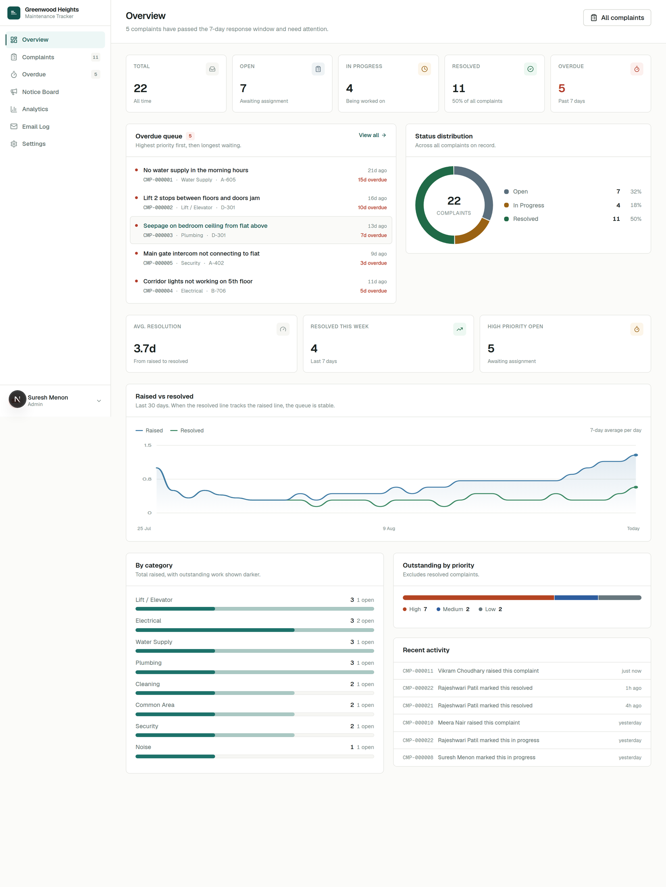
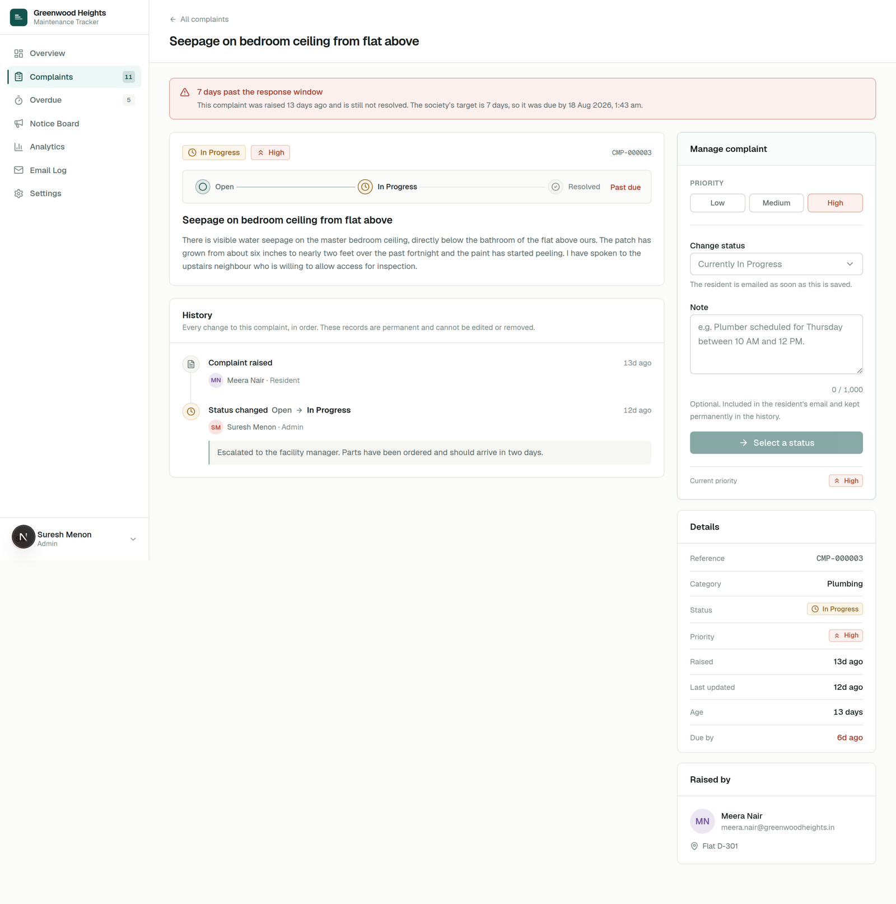
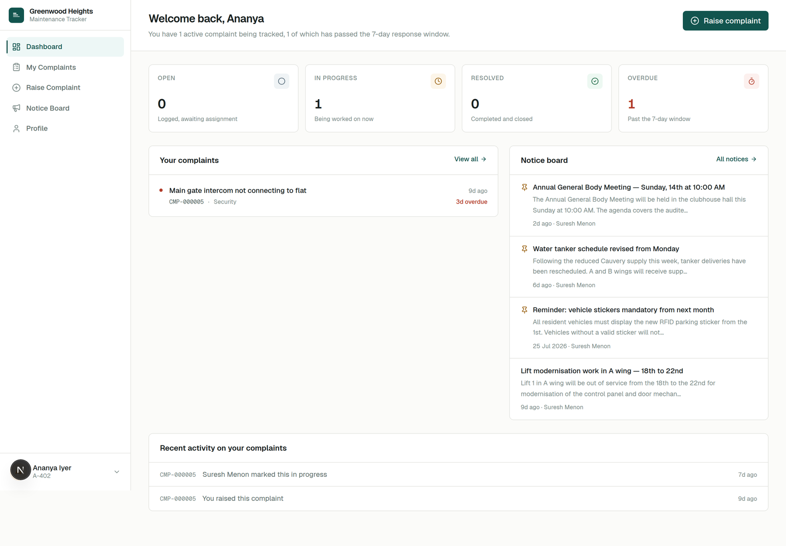
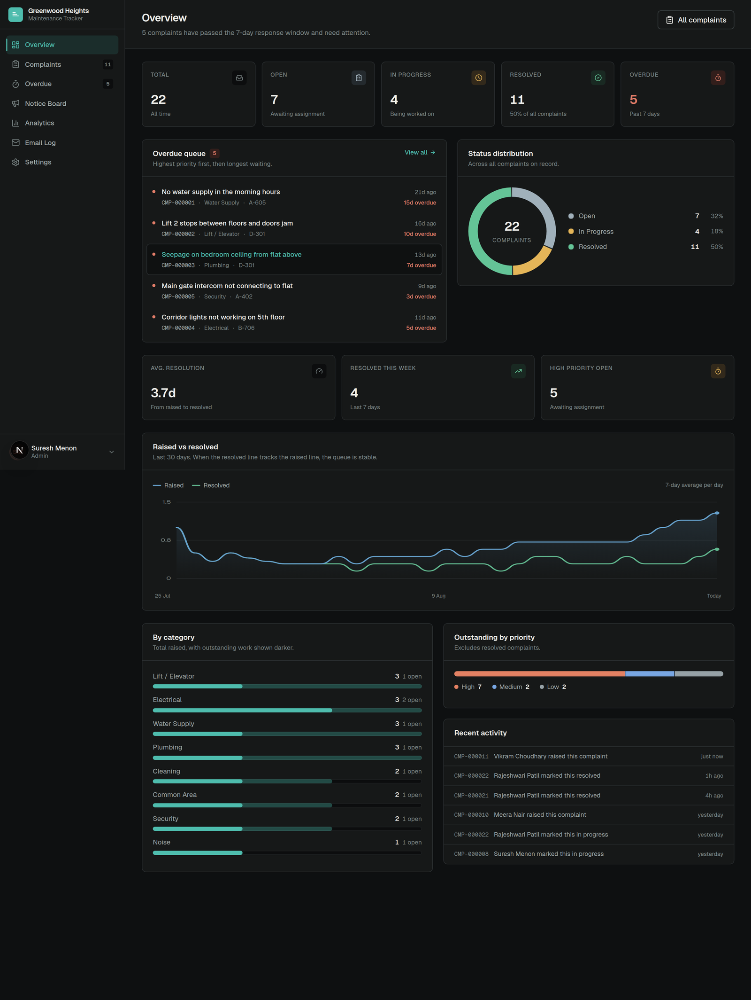
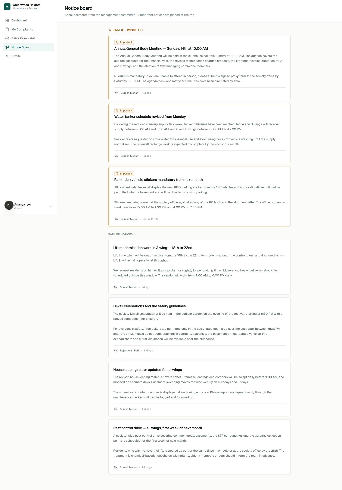
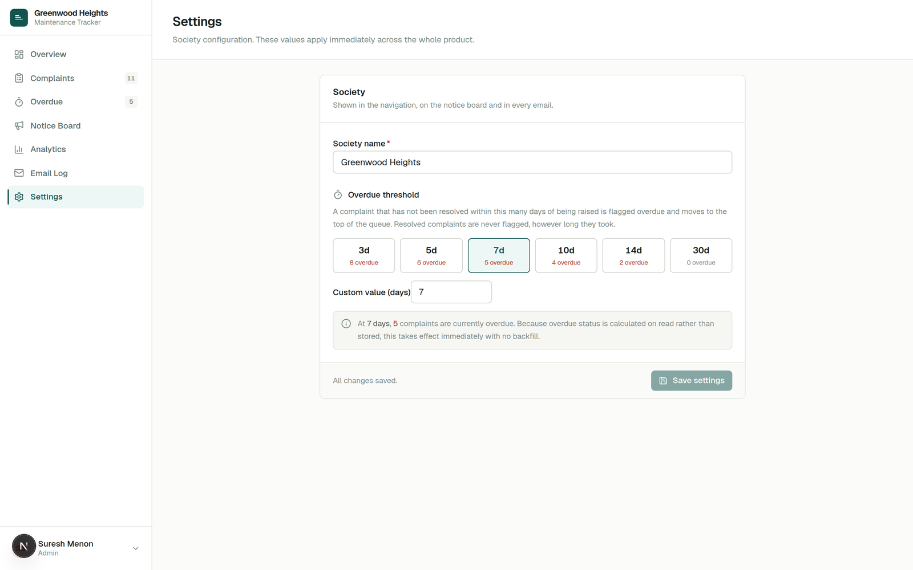
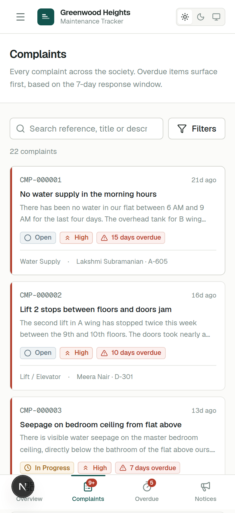

# Society Maintenance Tracker

A complaint lifecycle, notice board and reporting platform for residential societies. Residents raise maintenance complaints with photos and track them to resolution; the management committee triages them through a clear workflow with priorities, overdue detection and a permanent audit trail.

**Live demo:** [society-maintenance-tracker-two-omega.vercel.app](https://society-maintenance-tracker-two-omega.vercel.app) · **Demo credentials:** [below](#demo-credentials)

---

## The 28-second version

<video src="https://github.com/mithinsagar/society-maintenance-tracker/raw/master/docs/demo/society-maintenance-tracker.mp4" poster="https://github.com/mithinsagar/society-maintenance-tracker/raw/master/docs/demo/poster.jpg" controls muted loop playsinline width="100%"></video>

<sub>1920×1080 · 60 fps · with sound — [open the file directly](https://github.com/mithinsagar/society-maintenance-tracker/raw/master/docs/demo/society-maintenance-tracker.mp4) if the player does not load. Triage queue → complaint lifecycle → audit trail → derived overdue detection → notices and the email outbox → analytics → architecture. Every figure on screen is real seed data from `npm run db:seed`.</sub>

---

## Contents

- [Overview](#overview) · [Features](#features) · [Screens](#screens)
- [Architecture](#architecture) · [Tech stack](#tech-stack) · [Project structure](#project-structure)
- [Local setup](#local-setup) · [Environment variables](#environment-variables) · [Database](#database)
- [Documentation](#documentation) · [Testing](#testing) · [Deployment](#deployment)
- [Design decisions](#design-decisions) · [Security](#security-considerations)
- [Known limitations](#known-limitations) · [Future improvements](#future-improvements)

---

## Overview

Apartment societies handle a steady stream of maintenance complaints. Without a system, the committee cannot see what is pending or overdue, and residents have no visibility into progress at all. This application solves both sides of that problem:

**Residents** register, raise complaints with a category, description and optional photo, and follow each one through its full status history — every change, who made it, when, and what note they left.

**Administrators** get a triage queue that surfaces overdue work first, filter and search across every complaint, set priorities, move complaints through the lifecycle with notes, publish notices, and read a dashboard of what is actually happening.

Everyone stays informed: residents are emailed when their complaint's status changes and when an important notice is posted.

## Features

### Resident

- Registration and sign-in with role-based access
- Raise complaints — 11 categories, description, optional photo with drag-and-drop, preview, progress and retry
- Track every complaint with a lifecycle spine and complete audit trail
- Dashboard: open / in progress / resolved / overdue at a glance, recent activity, latest notices
- Filter and search own complaints by status, category, priority, overdue state and date range
- Notice board with important notices pinned to the top
- Profile and password management

### Administrator

- Triage queue ordered by what needs attention — overdue first, then priority, then age
- Server-side search, six filters, sorting and pagination
- Dedicated overdue view with a configurable threshold
- Status transitions with notes, validated against the lifecycle
- Priority management, recorded in the same audit trail
- Notice board management — publish, edit, pin, archive
- Dashboard and analytics: KPIs, status/category/priority distributions, 30-day trend, overdue queue, recent activity
- Email delivery log showing every notification and its outcome
- Settings: society name and overdue threshold, with a live preview of the impact

### System

- Immutable audit trail enforced by database triggers
- Overdue detection derived on read from a runtime-configurable threshold
- Transactional email outbox — delivery never blocks or reverses a complaint update
- Pluggable photo storage (Cloudinary in production, local disk with zero credentials)
- Light and dark themes, both designed rather than inverted
- Responsive across desktop, tablet and mobile with layout-specific navigation
- 88 automated tests against a real database

## Screens

| | |
|---|---|
| **Resident dashboard** | Status counts, recent complaints, pinned notices, activity feed |
| **Complaint detail** | Lifecycle spine, photo, full audit trail, metadata rail |
| **Admin overview** | KPI row, overdue queue, status donut, 30-day trend, category and priority breakdowns |
| **Admin complaints** | Dense ledger table with search, filters, sorting, pagination |
| **Notice board** | Pinned important notices, then chronological |
| **Email log** | Every notification generated, delivered or failed, with reasons |

### Screenshots

| Admin overview | Complaint detail |
|---|---|
|  |  |

| Resident dashboard | Dark mode |
|---|---|
|  |  |

| Notice board | Settings — live overdue preview |
|---|---|
|  |  |

| Mobile — tables become cards |
|---|
|  |

---

## Architecture

```
┌──────────────────────────────────────────────────────────────────┐
│  Browser — React 19 · Server + Client Components · Tailwind v4    │
│  Resident shell   │   Admin shell   │   light / dark themes       │
└───────────────┬──────────────────────────────┬───────────────────┘
                │ httpOnly session cookie      │ signed direct upload
                ▼                              ▼
┌──────────────────────────────────────┐   ┌─────────────────────┐
│  Next.js Route Handlers  (/api/*)    │   │  Cloudinary          │
│  ┌────────────────────────────────┐  │   │  (image CDN)         │
│  │ apiHandler: auth → zod → guard │  │   └─────────────────────┘
│  │        → service → envelope    │  │            ▲
│  └────────────────────────────────┘  │────────────┘ signature
│  services/  complaint · notice ·     │
│             dashboard · settings ·   │   ┌─────────────────────┐
│             auth · email             │   │  Resend (email)      │
└───────────────┬──────────────────────┘   └─────────────────────┘
                │ Drizzle ORM                          ▲
                ▼                                      │
┌──────────────────────────────────────┐   outbox dispatch, post-commit
│  PostgreSQL 16                       │───────────────┘
│  users · sessions · complaints ·     │
│  complaint_events · notices ·        │
│  app_settings · email_outbox         │
└──────────────────────────────────────┘
```

**Request path.** Cookie → indexed session lookup (returns user + role) → Zod parse of body/query → authorization guard → service (business rules, transactions) → typed JSON envelope. Every error funnels through one mapper.

**Layering.** Route handlers are thin — parse, authorize, delegate, respond. Everything that decides *what the product does* lives in `src/server/services/`, which is what makes the lifecycle rules testable without an HTTP layer.

## Tech stack

| Layer | Choice | Why |
|---|---|---|
| Framework | **Next.js 16** (App Router), TypeScript strict | One deployable unit containing both the HTTP API and the UI. A split Express + React repo doubles deployment surface and CORS config for no evaluation benefit. Route Handlers are a real REST API — curl-able, documentable, independently testable. Server Components render dashboards from a single DB round-trip with no client fetch waterfall. |
| Database | **PostgreSQL 16** | The domain is relational: ownership, audit trails, referential rules. Needs real enums, FK constraints, partial and trigram indexes, `GROUP BY` aggregates, transactions and triggers. |
| ORM | **Drizzle** | Migrations are plain, reviewable `.sql` files — for a project graded on database schema, showing real DDL is a feature. No native query engine, so nothing to download at build time and a smaller serverless cold start. Fully typed, SQL-shaped API. |
| Styling | **Tailwind v4** + **Radix UI** primitives | Radix provides correct focus traps, keyboard navigation and ARIA for dialogs, menus and selects. A component kit was **not** installed wholesale — the tokens and components here are authored for this product. |
| Validation | **Zod** | One schema per input, shared by client form and server handler. The server always re-validates. |
| Auth | Opaque sessions in Postgres + **bcryptjs** | See [Design decisions](#why-sessions-and-not-jwt). |
| Charts | Hand-built SVG | Three charts are ~400 lines of SVG. Writing them directly means the marks inherit the product's own colour tokens (correct in both themes automatically), there is no recognisable library default look, and the bundle carries no extra dependency. |
| Email | **Resend** behind an `EmailProvider` interface | Console provider when no key is set, so the pipeline is demonstrable with no account. |
| Storage | **Cloudinary** behind a `StorageProvider` interface | Local-disk provider when no credentials, so the app runs fully offline. |
| Testing | **Vitest** against a real Postgres | Real DB tests catch what mocks hide: constraints, transactions, cascade rules. |
| Hosting | **Vercel** + **Neon** | Both free tier, no credit card, native Next.js integration. |

### Deliberate non-choices

- **No NextAuth/Auth.js** — its abstractions hide exactly what is being evaluated (how RBAC is enforced), and are harder to explain than 150 lines of session code.
- **No repository layer over Drizzle** — Drizzle *is* the data-access layer. A wrapper would be ceremony. Business logic sits in a thin service layer instead.
- **No Redux/Zustand** — server state comes from Server Components; local UI state is `useState`. A store would be unjustified.

## Project structure

```
src/
  app/
    (auth)/            login · register                      # unauthenticated shell
    (app)/             dashboard · complaints · notices · profile
                       admin/{overview,complaints,overdue,notices,analytics,emails,settings}
    api/               the REST API
  server/
    auth/              session.ts · password.ts · guards.ts
    db/                schema.ts · index.ts · errors.ts
    services/          complaint · notice · dashboard · settings · auth
    email/             provider · providers · templates · outbox
    storage/           provider · cloudinary · local
    http.ts            apiHandler · response envelope · error mapper
    errors.ts          AppError hierarchy
    rate-limit.ts
  lib/                 constants · validation (zod) · overdue · utils · env · api-client
  components/
    ui/                button · field · select · primitives
    patterns/          indicators · timeline · complaint-list · complaint-detail · filters
                       notice-board · photo-upload · stat-card
    charts/            hand-built SVG charts
    shell/             app-shell · brand · nav-config
drizzle/               SQL migrations
scripts/               migrate · seed · reset
tests/                 authorization · lifecycle · overdue · notices
docs/                  API.md · SCHEMA.md · SYSTEM_DESIGN.md · TESTING.md
```

`src/lib/overdue.ts` is the single source of truth for the overdue rule — used by the SQL filter builder, the API serializer and the UI badge. The rule is never restated.

---

## Local setup

### Prerequisites

- Node.js ≥ 20.11
- PostgreSQL ≥ 14 running locally (or any Postgres connection string)

### Steps

```bash
git clone <your-repo-url> society-maintenance-tracker
cd society-maintenance-tracker

npm install

cp .env.example .env
# Edit .env — at minimum set DATABASE_URL, DIRECT_URL and AUTH_SECRET.
# Generate a secret with:  openssl rand -base64 48

createdb society_maintenance      # or: psql -c "CREATE DATABASE society_maintenance;"

npm run db:migrate                # apply migrations
npm run db:seed                   # realistic demo data

npm run dev                       # http://localhost:3000
```

**No third-party accounts are needed to run this.** Without Cloudinary credentials, photo uploads use the local-disk provider. Without a Resend key, emails render to the server console and are still recorded in the outbox, visible at Admin → Email log.

### Scripts

| Command | Purpose |
|---|---|
| `npm run dev` | Development server |
| `npm run build` | Production build |
| `npm start` | Serve the production build |
| `npm run typecheck` | `tsc --noEmit` |
| `npm run lint` | ESLint |
| `npm run format` | Prettier |
| `npm test` | Vitest integration suite (requires the dev server running) |
| `npm run db:generate` | Generate a migration from schema changes |
| `npm run db:migrate` | Apply migrations (idempotent) |
| `npm run db:seed` | Seed demo data |
| `npm run db:reset` | Drop and recreate the schema (dev only) |
| `npm run db:studio` | Drizzle Studio |

## Environment variables

Full annotated list in [`.env.example`](.env.example). Every variable is read once, in `src/lib/env.ts`, and validated with Zod at boot — a missing or malformed value fails loudly instead of surfacing as a runtime 500.

| Variable | Required | Purpose |
|---|---|---|
| `DATABASE_URL` | ✅ | Postgres connection (pooled, in production) |
| `DIRECT_URL` | ✅ | Non-pooled connection, used only by migrations |
| `APP_URL` | ✅ | Public origin; used for email links and cookie security |
| `AUTH_SECRET` | ✅ | ≥32 chars. Derives session-token hashes. Rotating it invalidates all sessions |
| `OVERDUE_THRESHOLD_DAYS` | — | Seeds the initial threshold only; the DB is authoritative afterwards |
| `CLOUDINARY_*` | — | Photo storage. Omit to use local disk |
| `RESEND_API_KEY` | — | Email. Omit to use the console provider |
| `EMAIL_FROM` | — | Verified sender address |
| `EMAIL_REDIRECT_TO` | — | Demo safety valve — routes all mail to one inbox |
| `RATE_LIMIT_DISABLED` | — | Test-only. Force-ignored when `NODE_ENV=production` |
| `SEED_*` | — | Demo account credentials for `db:seed` |

**No secret is ever committed.** `.env` is gitignored from the first commit; `.env.example` carries placeholders only. `src/lib/env.ts` is marked `server-only`, so importing it from a client component is a build error — the guarantee that no secret can reach the browser bundle.

## Database

Schema, ER diagram, constraints, triggers, index rationale and verified query plans: **[`docs/SCHEMA.md`](docs/SCHEMA.md)**.

Seven tables: `users`, `sessions`, `complaints`, `complaint_events`, `notices`, `app_settings`, `email_outbox`.

The two structural decisions worth reading about are the append-only `complaint_events` table (enforced by trigger, not convention) and the absence of any `is_overdue` column.

## Documentation

| Document | Contents |
|---|---|
| [`docs/API.md`](docs/API.md) | Every endpoint: method, auth, authorization, request, query params, responses, error codes |
| [`docs/SCHEMA.md`](docs/SCHEMA.md) | ER diagram, deletion policy, constraints, triggers, indexes, query plans |
| [`docs/SYSTEM_DESIGN.md`](docs/SYSTEM_DESIGN.md) | The 800-word design write-up required by the assignment |
| [`docs/TESTING.md`](docs/TESTING.md) | Test checklist — what is automated, what was verified manually, what needs human verification |

## Testing

```bash
npm run dev        # terminal 1 — the suite drives a real server
npm test           # terminal 2
```

88 tests across four suites, run against a **real PostgreSQL database and a running server** — not mocks. That is deliberate: the properties under test are transaction boundaries, database constraints, SQL-level ownership scoping and cookie handling, every one of which a mock would paper over.

| Suite | Covers |
|---|---|
| `authorization` | Unauthenticated rejection, resident→admin denial, cross-resident isolation, 404-not-403, privilege escalation, session revocation, password hashing |
| `lifecycle` | Every valid and invalid transition, terminal resolved state, audit-trail completeness, append-only enforcement, transactional integrity, notification queueing |
| `overdue` | The pure rule (boundaries, resolved exclusion, threshold changes) *and* that the SQL predicate agrees with it exactly |
| `notices` | Pinning, email fan-out, soft delete, validation, pagination, filtering, dashboard accuracy |

## Deployment

Target: **Vercel** (app) + **Neon** (Postgres) + **Cloudinary** (images) + **Resend** (email). All free tier.

1. **Neon** — create a project, copy the *pooled* connection string to `DATABASE_URL` and the *direct* one to `DIRECT_URL`.
2. **Vercel** — import the GitHub repo. Add every variable from `.env.example` under Settings → Environment Variables. Set `APP_URL` to your deployment URL.
3. **Migrate** — with the production `DIRECT_URL` in your shell: `npm run db:migrate`
4. **Seed** (optional, for the demo) — `npm run db:seed`
5. **Verify** — sign in as both roles, raise a complaint, change its status, check the email log, toggle the theme, load it on a phone.

`npm run build` must pass before deploying; it is currently clean, along with `typecheck` and `lint`.

## Demo credentials

Seeded by `npm run db:seed`. Configurable via `SEED_*` environment variables — change them before seeding anything public.

| Role | Email | Password |
|---|---|---|
| **Admin** | `admin@greenwoodheights.in` | `Admin@12345` |
| **Resident** | `ananya.iyer@greenwoodheights.in` | `Resident@12345` |

Both are one click away on the sign-in page. The seed creates 2 admins, 12 residents, 22 complaints across every category and status (5 currently overdue), 55 audit events, 7 notices and a populated email log.

---

## Design decisions

### Why one event log instead of a status-history table

Status changes and priority changes are the same shape of fact: *actor X changed field F from A to B at time T, with an optional note.* Two near-identical tables would mean a `UNION` for every timeline. One `complaint_events` table with a `type` discriminator gives the timeline as a single ordered query; the assignment's "status history" is `WHERE type = 'STATUS_CHANGED'`.

A `CREATED` event opens every trail, so the complete lifecycle is reconstructible from the log alone. `actor_role` is snapshotted, because an audit record should state what someone *was* when they acted.

### Why overdue is computed, not stored

A boolean column would need a nightly job to stay true, would go stale the instant the threshold changed, and would create a second source of truth free to disagree with the first. Deriving it means an admin can change the threshold from 7 days to 3 in Settings and every complaint reclassifies instantly — list, dashboard count, badge, email — with no migration and no backfill. The Settings screen previews the impact of each candidate threshold, which is only possible *because* the value is derived.

### Why sessions and not JWT

Every authorized request already loads the user to check their role and active status, so a JWT's "no database round-trip" advantage would buy nothing here — while costing the ability to revoke. Opaque tokens give real logout, real "sign out everywhere" on password change, and no algorithm-confusion footguns. Only an HMAC of each token is stored, so a database leak does not hand over live sessions.

### Why the browser uploads directly to Cloudinary

Vercel caps a serverless request body at 4.5 MB; a 5 MB photo proxied through a route handler would simply fail. Direct upload also keeps image bytes out of our functions and function duration low. The trade — the client briefly holds an upload permission — is managed by scoping the signature tightly and re-verifying the resulting asset server-side before persisting anything.

### Why email uses an outbox

A complaint update must not be reversible by a third-party outage. The intent to notify is committed *inside* the same transaction as the domain change, then dispatched *after* commit. A process that dies before dispatch leaves a `PENDING` row to retry; a provider failure degrades to "the update worked, the email did not", which the API reports honestly and the UI shows as a soft warning rather than an error.

### Why the charts are hand-written

Chart libraries are heavy and their defaults are instantly recognisable. Three charts in raw SVG give total control over the visual language, inherit the product's colour tokens (so both themes are correct automatically), and add no dependency. Each also renders a visually-hidden data table, so the numbers reach a screen reader rather than being locked inside a picture.

## Security considerations

| Area | Approach |
|---|---|
| Passwords | bcrypt cost 12. Never logged, never returned. |
| Sessions | Opaque 32-byte tokens; only an HMAC stored. `httpOnly`, `secure` in production, `sameSite=lax`, 7-day rolling expiry. |
| Authorization | Enforced in route handlers and server components via `requireUser` / `requireAdmin`, re-derived from the database each request. Edge middleware only redirects — it is not access control. |
| Ownership | Applied as a SQL `WHERE` clause, not a post-filter. No query parameter can widen a resident's list. |
| Enumeration | Login returns one message for both failure modes and equalises timing with a dummy hash comparison. |
| Privilege escalation | `role` is not accepted at registration. Admins are seeded or promoted in the database. |
| Injection | Parameterised queries throughout via Drizzle. |
| XSS | React escaping; no `dangerouslySetInnerHTML` on user content. Notice bodies render as plain text. |
| CSRF | Same-origin API + `sameSite=lax` cookies. |
| Uploads | Type, size, magic-byte and server-side asset verification. Path-traversal guard on the local provider. |
| Headers | CSP, `X-Content-Type-Options`, `X-Frame-Options: DENY`, `Referrer-Policy`, `Permissions-Policy`, HSTS. |
| Rate limiting | Auth and upload endpoints. In-memory — see limitations. |
| Error responses | One mapper. Stack traces and driver messages never cross the wire; 5xx returns only a `requestId` that matches a server log line. |
| Secrets | Validated once in a `server-only` module. Importing it from a client component is a build error. |

## Known limitations

Stated plainly rather than discovered in review.

- **Rate limiting is in-memory**, so it counts per process. On a single Vercel region that is a real defence; across many concurrent instances the effective limit is (limit × instances). The correct answer is a shared counter (Upstash / Vercel KV) — a drop-in replacement for `consume()`.
- **Email retries are manual**, from the admin log. There is no background retry worker.
- **One global overdue threshold.** Per-priority SLAs would be a natural extension, but the assignment specifies a single configurable number and building more would be inventing requirements.
- **No password reset flow.** Out of assignment scope.
- **The local storage provider is not production-viable** on serverless — each instance has its own ephemeral filesystem. It exists so the app runs with zero credentials; Cloudinary is selected automatically whenever credentials are present.
- **Search uses trigram `ILIKE`.** Correct and indexed at this scale; a `tsvector` column with a full-text index is the right move past roughly a million rows.
- **`db:seed` disables the audit triggers** to wipe demo data. Intentional and explicit, but it means the seed script is the one place that can destroy history.

## Future improvements

- Distributed rate limiting via Upstash Redis
- Background retry worker for failed notifications, and a daily overdue digest to the committee
- Per-category or per-priority SLA targets
- Complaint assignment to named staff or vendors, with their own queue
- Resident-visible comment thread on a complaint, separate from the audit trail
- CSV export of complaints for AGM reporting
- Full-text search with `tsvector` and ranked results
- Push notifications and a PWA install target
- Multi-society tenancy

## License

MIT — see [LICENSE](LICENSE).
