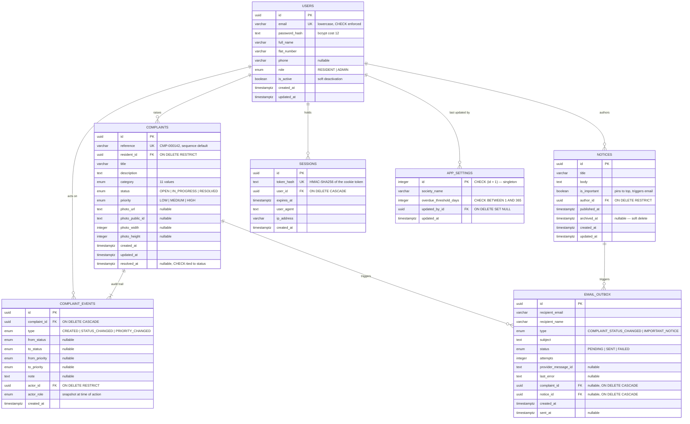

# Database Schema

PostgreSQL 16. Defined in `src/server/db/schema.ts`; migrations are plain reviewable SQL in `drizzle/`.

## Entity relationship diagram



## Deletion policy and referential integrity

Deletion behaviour is a design decision here, not a default.

| Relationship | Rule | Why |
|---|---|---|
| `complaints.resident_id → users` | `RESTRICT` | A resident with complaints must not be deletable — it would orphan an audit trail. Deactivation (`is_active = false`) is the supported path. |
| `complaint_events.actor_id → users` | `RESTRICT` | Same reason: the trail must always resolve its actor. |
| `complaint_events.complaint_id → complaints` | `CASCADE` | If a complaint is ever purged (an erasure request), its trail goes with it. There is no delete endpoint. |
| `sessions.user_id → users` | `CASCADE` | Sessions are worthless without their user. |
| `notices.author_id → users` | `RESTRICT` | Notices are community record and must keep an attributable author. |
| `app_settings.updated_by_id → users` | `SET NULL` | Who last changed a setting is useful but not essential. |
| Notices | **soft delete** (`archived_at`) | A resident may have acted on a notice; erasing the row would destroy the evidence it was ever posted. |

## Constraints

| Constraint | Table | Guarantees |
|---|---|---|
| `users_email_lowercase_check` | `users` | Email is stored lowercase, so uniqueness is genuinely case-insensitive — a database guarantee, not an application convention. |
| `complaints_reference_format_check` | `complaints` | `reference` matches `CMP-\d{6,}` even if a caller supplies it explicitly. |
| `complaints_resolved_at_consistency_check` | `complaints` | `status = 'RESOLVED'` ⟺ `resolved_at IS NOT NULL`. Closes the gap where code could set one without the other and corrupt resolution-time reporting. |
| `complaint_events_payload_check` | `complaint_events` | Each event type carries exactly the fields it is about — a `STATUS_CHANGED` row cannot exist without statuses. |
| `app_settings_singleton_check` | `app_settings` | `id = 1`. A second settings row is impossible. |
| `app_settings_threshold_range_check` | `app_settings` | Threshold between 1 and 365 days. |

## Triggers

| Trigger | Purpose |
|---|---|
| `complaint_events_no_update` / `_no_delete` | **Raises an exception on any `UPDATE` or `DELETE`.** This is what makes the audit trail immutable at the storage layer rather than by convention. The service exposes no mutation path either, but a trigger survives refactors, bugs and stray `psql` sessions. |
| `*_set_updated_at` | Maintains `updated_at` on `users`, `complaints`, `notices`, `app_settings` in the database, so every write path is covered — including migrations and any future service. |

The seed script must explicitly `DISABLE TRIGGER` to wipe demo data. That friction is intentional: destroying an audit trail should be a deliberate act.

## Indexes and their rationale

Every index exists to serve a specific query. None was added speculatively.

| Index | Serves |
|---|---|
| `users.email` (unique) | Login lookup; enforces one account per email |
| `users_role_is_active_idx` | Recipient list for the important-notice fan-out |
| `sessions.token_hash` (unique) | **The hottest query in the app** — every authenticated request |
| `sessions_expires_at_idx` | Expired-session sweep |
| `complaints_resident_created_idx` | Resident's own list, newest first |
| `complaints_status_created_idx` | Admin status filter; leading equality column + range column |
| `complaints_unresolved_created_idx` **(partial)** | The overdue predicate. `WHERE status <> 'RESOLVED'` keeps the index covering only live complaints, so it stays small as the resolved archive grows — which becomes the majority of the table over time |
| `complaints_category_idx` | Category filter and dashboard `GROUP BY` |
| `complaints_priority_created_idx` | Admin queue ordering |
| `complaints_search_trgm_idx` **(GIN, pg_trgm)** | Substring search across reference + title + description. A B-tree cannot serve `ILIKE '%term%'`; a trigram index turns it into a bitmap index scan |
| `complaints.reference` (unique) | Search by reference |
| `complaint_events_complaint_created_idx` | Timeline fetch for one complaint, in order |
| `complaint_events_created_at_idx` | "Recent activity" feed |
| `notices_important_published_idx` | The notice-board ordering exactly: pinned first, then newest |
| `email_outbox_status_created_idx` | Retry sweep over `PENDING` / `FAILED` |

### Verified query plans

Measured against 20,000 seeded complaints:

```
EXPLAIN SELECT id FROM complaints
 WHERE status <> 'RESOLVED' AND created_at < now() - interval '7 days'
 ORDER BY created_at LIMIT 20;

 Limit
   ->  Index Scan using complaints_unresolved_created_idx on complaints
         Index Cond: (created_at < (now() - '7 days'::interval))
```

```
EXPLAIN SELECT id FROM complaints
 WHERE (coalesce(title,'') || ' ' || coalesce(description,'') || ' ' || reference)
       ILIKE '%CMP-0001%' LIMIT 20;

 Limit
   ->  Bitmap Heap Scan on complaints
         ->  Bitmap Index Scan on complaints_search_trgm_idx
```

Both are index scans, not sequential scans.

## Reference generation

```sql
CREATE SEQUENCE complaint_reference_seq AS BIGINT START WITH 1;

ALTER TABLE complaints ALTER COLUMN reference
  SET DEFAULT 'CMP-' || lpad(nextval('complaint_reference_seq')::text, 6, '0');
```

Allocation must be atomic. `SELECT max(reference) + 1` would race under concurrent inserts, and serialising it would mean locking the whole table on every complaint. `nextval()` is atomic by construction and never blocks. Gaps are expected and acceptable — a rolled-back transaction consumes its number, and a reference is an identifier, not an audited count.

The sequence is created in migration `0000`, before the tables, because Postgres resolves a column `DEFAULT` at DDL time.

## What is deliberately *not* in the schema

- **No `is_overdue` column.** Overdue is derived on read. See `docs/SYSTEM_DESIGN.md`.
- **No image bytes.** Only a URL, `public_id` and dimensions. Binaries live in object storage.
- **No JSON history blob.** The audit trail is a proper relational table with foreign keys, constraints and indexes.
- **No `deleted_at` on complaints.** There is no delete path; a complaint's terminal state is `RESOLVED`.

## Migrations

| File | Contents |
|---|---|
| `0000_complaint_reference_sequence.sql` | The sequence, created before the tables that depend on it |
| `0001_init.sql` | Enums, tables, foreign keys, indexes, CHECK constraints |
| `0002_domain_invariants.sql` | Reference-format check, append-only triggers, `updated_at` triggers, `pg_trgm` + trigram index, partial overdue index, settings singleton row |

```bash
npm run db:migrate   # apply, idempotent — safe to re-run
npm run db:reset     # drop and recreate (development only; refuses NODE_ENV=production)
npm run db:seed      # demo data
```
